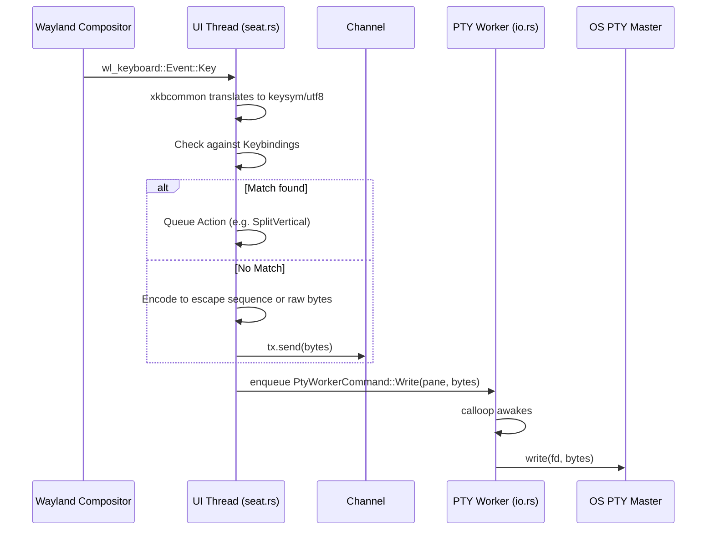
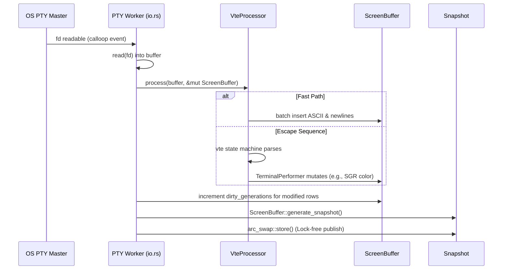
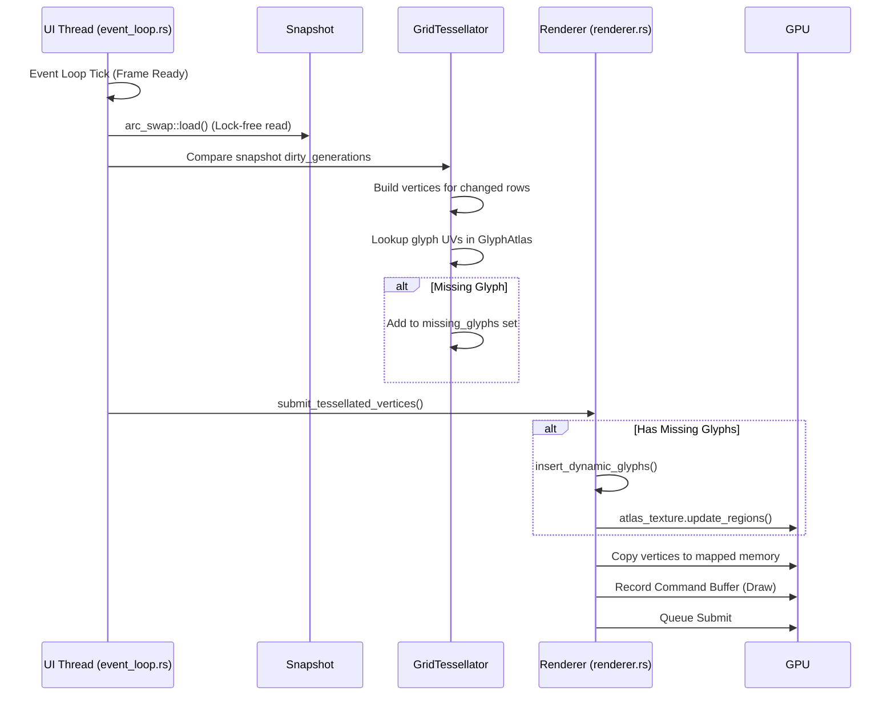

# Forge Data Flow Analysis

This document traces the path of input, output, and terminal state through the Forge architecture.

## 1. Input Flow (Keyboard to PTY)

## 2. Output Flow (PTY to ScreenBuffer)

## 3. Rendering Flow (State to Screen)

